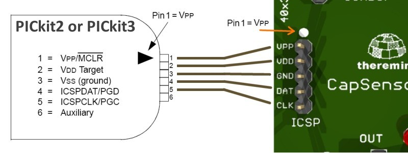

# Usage
After compilation or after
In the resource file

* pk2cmd
* PK2DeviceFile.dat
* PK2V023200.hex

Put 3 files in
This file is available from the [microchip site GitHub](https://github.com/psmay/pk2cmd.git)

**Connect to PICkit2**:

